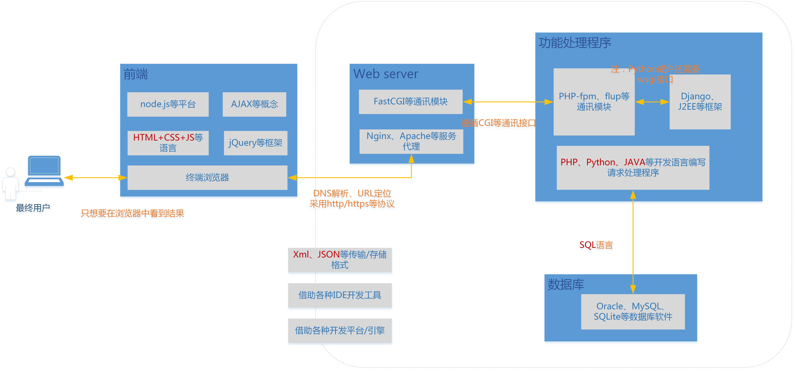

## day1 2018.4.24

阅读了知乎上的一个问题
> [Web 建站技术中，HTML、HTML5、XHTML、CSS、SQL、JavaScript、PHP、ASP.NET、Web Services 是什么？](https://www.zhihu.com/question/22689579)

了解到了一个普通网站访问的过程：

1. 用户操作浏览器访问，浏览器向服务器发出一个 HTTP 请求；
2. 服务器接收到 HTTP 请求，Web Server 进行相应的初步处理，使用服务器脚本生成页面；
> Web Server: 可以使用Nginx/Apache/tomcat/IIS/lighttpd等现成的工具,也可利用node.js等平台添加模块自己形成满足自己要求的代理工具)

3. 服务器脚本（利用Web Framework）调用本地和客户端传来的数据，生成页面；
> 服务器脚本的作用：
> 1. 动态地向web页面编辑、改变或添加任何的内容;
> 2. 对由HTML表单提交的用户请求或数据进行相应;
> 3. 访问数据或数据库，并向浏览器返回结果;
> 4. 为不同的用户定制页面;
> 5. 提高网页安全性;

4. Web Server 将生成的页面作为 HTTP 响应的 body，根据不同的处理结果生成 HTTP header，发回给客户端；
> 常见状态码：
> * 200 OK - [GET]：服务器成功返回用户请求的数据，该操作是幂等的（Idempotent）。
> * 201 CREATED - [POST/PUT/PATCH]：用户新建或修改数据成功。
> * 202 Accepted - [*]：表示一个请求已经进入后台排队（异步任务）
> * 204 NO CONTENT - [DELETE]：用户删除数据成功。
> * 400 INVALID REQUEST - [POST/PUT/PATCH]：用户发出的请求有错误，服务器没有进行新建或修改数据的操作，该操作是幂等的。
> * 401 Unauthorized - [*]：表示用户没有权限（令牌、用户名、密码错误）。
> * 403 Forbidden - [*] 表示用户得到授权（与401错误相对），但是访问是被禁止的。
> * 404 NOT FOUND - [*]：用户发出的请求针对的是不存在的记录，服务器没有进行操作，该操作是幂等的。
> * 406 Not Acceptable - [GET]：用户请求的格式不可得（比如用户请求JSON格式，但是只有XML格式）。
> * 410 Gone -[GET]：用户请求的资源被永久删除，且不会再得到的。
> * 422 Unprocesable entity - [POST/PUT/PATCH] 当创建一个对象时，发生一个验证错误。
> * 500 INTERNAL SERVER ERROR - [*]：服务器发生错误，用户将无法判断发出的请求是否成功。
>
> 详见：[HTTP/1.1: Status Code Definitions](https://www.w3.org/Protocols/rfc2616/rfc2616-sec10.html)

5. 客户端（浏览器）接收到 HTTP 响应，通常第一个请求得到的 HTTP 响应的 body 里是 HTML 代码，于是对 HTML 代码开始解析；
6. 解析过程中遇到引用的服务器上的资源（额外的 CSS、JS代码，图片、音视频，附件等），再向 Web Server 发送请求，Web Server 找到对应的文件，发送回来；
7. 浏览器解析 HTML 包含的内容，用得到的 CSS 代码进行外观上的进一步渲染，JS 代码也可能会对外观进行一定的处理；
8. 用户与页面交互（点击，悬停等等）时，JS 代码对此作出一定的反应，添加特效与动画；
9. 交互的过程中可能需要向服务器索取或提交额外的数据（局部的刷新，类似微博的新消息通知），一般不是跳转就是通过 JS 代码（响应某个动作或者定时）向 Web Server 发送请求，Web Server 再用服务器脚本进行处理（生成资源or写入数据之类的），把资源返回给客户端，客户端用得到的资源来实现动态效果或其他改变。

图示:

常用的几种架构：

1. LAMP = Linux + Apache + MySQL + PHP
2. J2EE = UNIX操作系统，Apache做Web Server，Tomcat转换JSP到Java给服务器程序用
3. ASP.NET = SQL Server做数据库，IIS做Web Server
4. MEAN = MongoDB做数据库，Express做Web Framework，Angular 做JavaScript 框架，Node.js 用于编写 Web Server。

### 未来深入：

> 1. HTTP
> 2. 在实践中体验整个过程