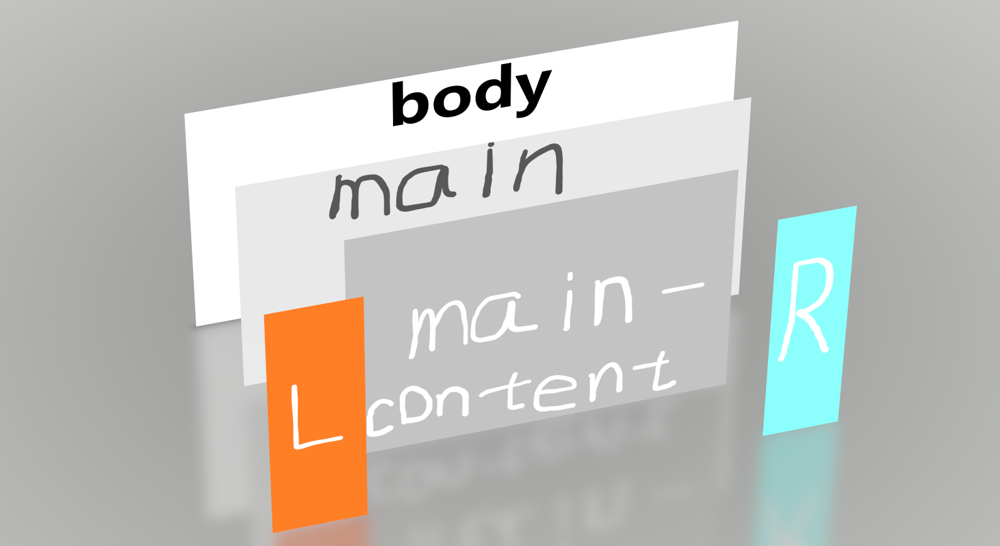

# day7~8 2018.4.30~2018.5.1

## 1. 定位 `position`

### 1.1 定位的值

```css
/* 静态定位，默认值。将元素放入正常文档流 */
position: static;
/* 相对定位。占据正常文档流，通过top/bottom/left/right修改位置 */
position: relative;
/* 绝对定位。脱离正常文档流，相对于 <html> 元素或其最近的定位祖先。通过top/bottom/left/right修改位置 */
position: absolute;
/* 固定定位。脱离正常文档流，相对于浏览器视口本身 */
position: fixed;
```

### 1.2 绝对定位 `position: absolute`

#### 1.2.1 绝对定位和float的关系

①两者都有`块状化`。一旦使用，其display为block或者table  
②两者都有`破坏性`。  
③两者都能`BFC`。  
④两者都有`包裹性`。

#### 1.2.2 [absolute的包含块](https://www.jianshu.com/p/c67a7c1cbb00)

> 定义: 定位一个元素需要计算其和另外一个矩形区域的相对位置，这个矩形区域就是该元素的包含块。

1. 根元素的包含块称为初始包含块，通常它的大小就是可视区域的大小。
2. 元素的position为`static`或者`relative`的其他元素，它的包含块就是**最近祖先的箱子模型中的内容区域**
3. 元素的position为`fixed`，那么该元素脱离HTML文档，其包含块为当前屏幕的可视窗口。(**初始包含块**)
4. 如果元素的位置属性为`absolute`，那么该元素的包含块由**最近的**含**有属性relative、absolute、fixed**的**祖先**决定:

> 1. 如果该祖先元素是块级元素，那么包含块是其**内边距**所包围的区域（注意不是content区域）；
2. 如果是行内元素，那么元素的包含块是由该祖先第一个和最后一个inline框的内边距区域以及direction决定的。

#### 1.2.3 无依赖的absolute

> 无依赖指的是当其祖先元素全是非定位元素，没有设置top/bottom/left/right

其位置还是在**当前位置**，只是因为BFC了，所以外边距不会重叠。

实战: 我们可以用无依赖的absolute借助margin调整位置做到 各类图标定位、超越常规布局的排版、下拉列表的定位、占位符效果模拟

#### 1.2.4 absolute的流体特性

> 当**对立定位**方向属性同时有**具体定位数值**的时候, 就会发生流体特性。会被拉伸。所以想让绝对定位元素宽高**自适应**于包含块，应使用流体特性写法

### 1.3 相对定位 `position: relative`

1. 相对自身、无侵入。限制absolute
2. left/top/right/bottom的百分比值相对于包含块计算。如果包含块没有设置高度或者不是"格式化高度"，则无效

### 1.4 固定定位 `position: fixed`

当top/bottom/left/right没设置时(无依赖的固定定位), 可将目标元素定位到想要的位置

### 1.5 `z-index`

> 表示一个元素在叠加顺序上的上下立体关系

1. 只对定位元素有效
2. 如果父元素z-index有效, 那么子元素无论是否设置z-index都和父元素一致，会在父元素上方
3. 如果两个元素都没有设置z-index, 则定位元素覆盖未定位元素
4. 如果两个元素都设置了z-index且相同，则按文档流顺序，后面覆盖前面的

## 2. 弹性盒子 `flex`

[flex语法详解(阮一峰)](http://www.ruanyifeng.com/blog/2015/07/flex-grammar.html)  
[flex布局讲解(阮一峰)](http://www.ruanyifeng.com/blog/2015/07/flex-examples.html)

## 3. 布局总结

### 3.1 [布局方式](http://www.cnblogs.com/chaixiaozhi/p/8486647.html)

#### 3.1.1 一列布局

固定宽高，设置`margin: 0 auto; `水平居中

#### 3.1.2 两列布局(左侧固定, 右侧自适应)

[七种实现左侧固定，右侧自适应两栏布局的方法](https://segmentfault.com/a/1190000010698609)

#### 3.1.3 三列布局(两侧顶宽, 中间自适应)

常用的3种三栏布局: [绝对定位法、圣杯/双飞翼、自身浮动法](http://www.zhangxinxu.com/wordpress/2009/11/%E6%88%91%E7%86%9F%E7%9F%A5%E7%9A%84%E4%B8%89%E7%A7%8D%E4%B8%89%E6%A0%8F%E7%BD%91%E9%A1%B5%E5%AE%BD%E5%BA%A6%E8%87%AA%E9%80%82%E5%BA%94%E5%B8%83%E5%B1%80%E6%96%B9%E6%B3%95/)

[圣杯布局 & 双飞翼布局](http://www.cnblogs.com/imwtr/p/4441741.html)

> 圣杯布局跟双飞翼布局的实现，目的都是左右两栏固定宽度，中间部分自适应。

##### 3.1.3.1 圣杯布局


```html
<header><h4>Header内容区</h4></header>
<div class="container">
<div class="middle"><h4>中间弹性区</h4></div> 
<div class="left"><h4>左边栏</h4></div> 
<div class="right"><h4>右边栏</h4></div>
</div>
<footer><h4>Footer内容区</h4></footer>
```

例子: (假设左右为200px)

1. html代码中, middle部分首先要放在container的最前部分(优先渲染)。然后是left,right
2. 将三者都`float:left`, 再加上一个`position:relative`(因为相对定位后面会用到）
3. middle部分 `width:100%`占满
4. 此时middle占满了，所以要把left拉到最左边，使用`margin-left:-100%`, 同理right拉到最右边, 使用`margin-left: -200px`
5. 这时left拉回来了，但会覆盖middle内容的左端，要把middle内容拉出来，所以在外围container加上`padding:0 200px`(左右盒子宽度)
6. middle内容拉回来了，但left也跟着过来了，所以要还原，就对left使用相对定位`left:-200px`。同理，right也要相对定位还原 `right:-200px`
7. 最好给body加一个安全宽度`min-width`

##### 3.1.3.2 双飞翼布局




例子: (假设左右为200px)

1. html代码中，main要放最前边，sub  extra
2. 将main  sub  extra 都`float:left`
3. 将main占满 `width:100%`
4. 此时main占满了，所以要把sub拉到最左边，使用`margin-left:-100%`  同理 extra使用`margin-left:-200px`
5. main内容被覆盖了吧，除了使用外围的`padding`，还可以考虑使用margin:给main增加一个内层div, 然后`margin:0 200px`
6. main正确展示

### 3.2 对齐方式

#### 3.2.1 水平居中

种类|处理方法
---|---
行内元素(`inline-block`)|`text-align: center;`
块元素(定宽)|`margin: 0 auto;`
块元素(不定宽)|①用table包装; 对table`margin: auto;`
  |②`display: inline-block;` `text-align: center;`
  |③父元素设置`float`, `position:relative`和`left:50%`；子元素设置`position:relative`和`left:-50%`
  
#### 3.2.2 垂直居中

种类|处理方法
---|---
父元素高度确定的行内元素|`line-height`
高度不确定的块元素|父元素`display:table-cell;`  `vertical-align:middle`
高度确定的块元素|①计算并设定`margin`
  |②父元素`relative`,子元素`absolute;` `top:50%;` `left:50%`并调整margin